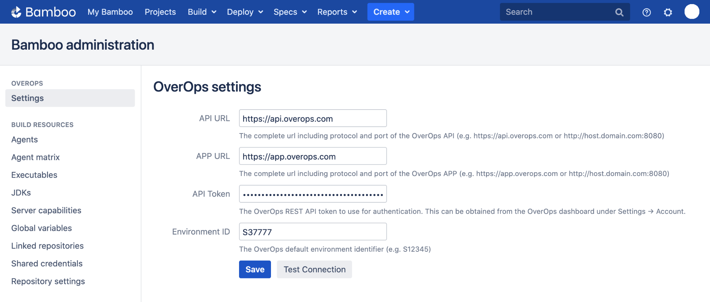
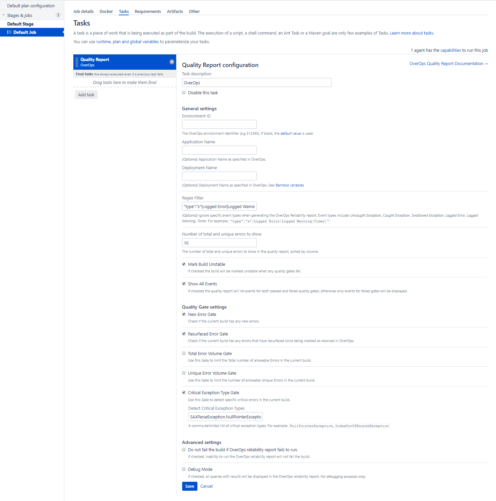

# OverOps Quality Report - Bamboo App

This app provides a mechanism for applying OverOps severity assignment and regression analysis to new builds to allow application owners, DevOps engineers, and SREs to determine the quality of their code before promoting it into production.

Run this app as a post build step after all other testing is complete to generate a Quality Report that will determine the stability of the build. From the Quality Report you can drill down into each specific error using the OverOps [Automated Root Cause](https://doc.overops.com/docs/automated-root-cause-arc) analysis screen to solve the issue.

For more information about this app and [quality gates](https://doc.overops.com/docs/overops-quality-gates), see the [OverOps CI/CD Pipeline Integrations guide](https://doc.overops.com/docs/cicd-pipeline).

## Installation

Navigate to Bamboo Administration &rarr; Manage apps. Click "Find New Apps" and search for "OverOps" to install the app from the Atlassian Marketplace. Alternatively, you may download the [latest release](https://github.com/takipi/bamboo-overops-plugin/releases) and click "Upload app" to install the app directly.

## Global Configuration

After installing the app, configure it to connect to OverOps.

From Bamboo Administration, select "Settings" under "OverOps". Enter the API URL and your API Token. Optionally, you may also set the default Environment ID.



### API URL

The complete URL of the OverOps API, including port. For example, https://api.overops.com for SaaS or http://host.domain.com:8080 for on prem.

### API Token

The OverOps REST API token to use for authentication. [This can be obtained from the OverOps dashboard under Settings &rarr; Account](https://doc.overops.com/docs/api-token).

### Environment ID

The default OverOps environment identifier (e.g. S12345) if none is specified in the Quality Report configuration for your project.

#### Testing

Click *Test Connection* to confirm connectivity to the API server. If an Environment ID is provided, this will also confirm the credentials provided have access to the environment.

## Quality Report Configuration

Navigate to Plan Configuration &rarr; Tasks for your Bamboo project. Click "Add task" and search for the OverOps Quality Report.



### General Settings

#### Environment ID

The OverOps environment identifier (e.g S4567) If no value is provided here, the default value provided in the global configuration will be used.

#### Application Name

*(Optional)* [Application Name](https://doc.overops.com/docs/naming-your-application-server-deployment) as specified in OverOps. [Bamboo variables](https://confluence.atlassian.com/bamboo/bamboo-variables-289277087.html) may be used in this field.

#### Deployment Name

*(Optional)* [Deployment Name](https://doc.overops.com/docs/naming-your-application-server-deployment) as specified in OverOps. [Bamboo variables](https://confluence.atlassian.com/bamboo/bamboo-variables-289277087.html) may be used in this field.

#### Regex Filter

Filter out specific event types from the OverOps Quality Report. Event types include: *Uncaught Exception, Caught Exception, Swallowed Exception, Logged Error, Logged Warning, Timer*

**Example:** ```"type":\"s*(Logged Error|Logged Warning|Timer)```

#### Number of total and unique errors to show

Prints the top X events (as provided by this parameter) with the highest volume of errors detected in the build. This is used in conjunction with the Total Error Volume Gate and the Unique Error Volume Gate to identify the errors which caused a build to fail.

#### Mark Build Unstable

If checked the build will be marked ***failed*** if any quality gate did not pass.

#### Show All Events

If checked the quality report will list events for both passed and failed quality gates, otherwise only events for failed gates will be displayed.

### Quality Gate Settings

#### New Error Gate

Detect all new errors in the build.

#### Resurfaced Error Gate

Detect all resurfaced errors in the build.

#### Total Error Volume Gate

Set the max total error volume allowed.

#### Unique Error Volume Gate

Set the max unique error volume allowed.

#### Critical Exception Type Gate

A comma delimited list of exception types that are deemed as critical.

**Example:** `NullPointerException,IndexOutOfBoundsException`

#### Do not fail the build if OverOps reliability report fails to run

If checked, inability to run the OverOps reliability report will not fail the build.

#### Debug

If checked, all queries and results will be logged. *For debugging purposes only.*

## Troubleshooting

For short-lived applications, [we recommend](https://support.overops.com/hc/en-us/articles/360041054474-Best-Practice-Short-lived-application-considerations) using the ```-Dtakipi.shutdown.gracetime=20000``` agent property.

## Building from source

### Install Atlassian SDK

Before building the app, you must install the Atlassian SDK for [Windows](https://developer.atlassian.com/server/framework/atlassian-sdk/install-the-atlassian-sdk-on-a-windows-system/), [Linux or Mac](https://developer.atlassian.com/server/framework/atlassian-sdk/install-the-atlassian-sdk-on-a-linux-or-mac-system/). Verify that the SDK has been installed using the `atlas-version` command, which produces output similar to:

```sh
ATLAS Version:    8.0.16
ATLAS Home:       /usr/local/Cellar/atlassian-plugin-sdk/8.0.16/libexec
ATLAS Scripts:    /usr/local/Cellar/atlassian-plugin-sdk/8.0.16/libexec/bin
ATLAS Maven Home: /usr/local/Cellar/atlassian-plugin-sdk/8.0.16/libexec/apache-maven-3.5.4
AMPS Version:     8.0.2
--------
Executing: /usr/local/Cellar/atlassian-plugin-sdk/8.0.16/libexec/apache-maven-3.5.4/bin/mvn --version -gs /usr/local/Cellar/atlassian-plugin-sdk/8.0.16/libexec/apache-maven-3.5.4/conf/settings.xml
Apache Maven 3.5.4 (1edded0938998edf8bf061f1ceb3cfdeccf443fe; 2018-06-17T12:33:14-06:00)
Maven home: /usr/local/Cellar/atlassian-plugin-sdk/8.0.16/libexec/apache-maven-3.5.4
Java version: 1.8.0_191, vendor: Oracle Corporation, runtime: /Library/Java/JavaVirtualMachines/jdk1.8.0_191.jdk/Contents/Home/jre
Default locale: en_US, platform encoding: UTF-8
OS name: "mac os x", version: "10.14.6", arch: "x86_64", family: "mac"
```

### Build the app

After cloning this project, build the app with `atlas-mvn clean package`. The resulting `jar` and `obr` files can be found in the `target/` directory.

Deploy the app by uploading the `jar` or `obr` on the Bamboo Administration Manage apps page.

Debug logs can be found in `/var/atlassian/application-data/bamboo/logs/atlassian-bamboo.log`

### Developer documentation

* [`atlas-create-bamboo-plugin`](https://developer.atlassian.com/server/framework/atlassian-sdk/atlas-create-bamboo-plugin/)
* [Gettings started](https://developer.atlassian.com/server/bamboo/)
* [Bamboo plugin guide](https://developer.atlassian.com/server/bamboo/bamboo-plugin-guide/)
* [Atlassian Spring Scanner](https://bitbucket.org/atlassian/atlassian-spring-scanner/src/1.2.x/README.md?at=1.2.x&fileviewer=file-view-default)
* [Configuration of Instructions in Atlassian Plugins](https://developer.atlassian.com/server/framework/atlassian-sdk/configuration-of-instructions-in-atlassian-plugins/)
